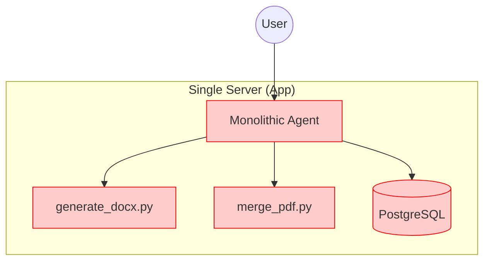
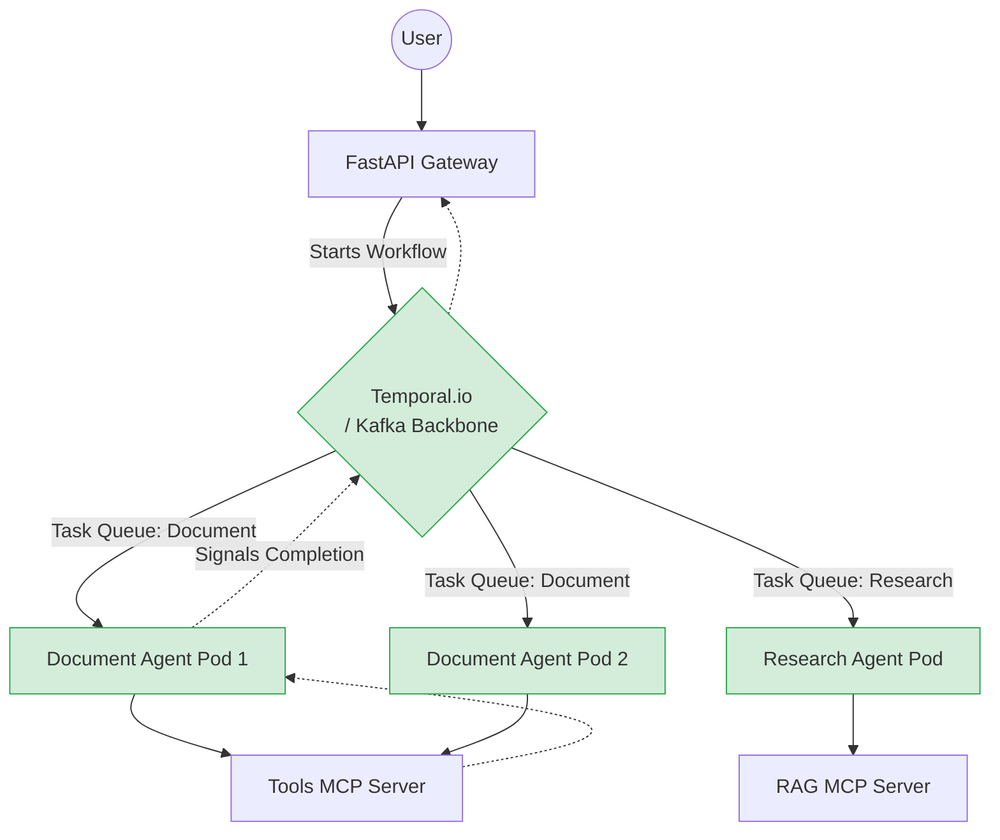

# AI Agent Architecture Evolution 🚀

우리가 논의하며 발전시켜 온 AI 에이전트 시스템의 아키텍처 진화 과정을 단계별로 기록한 다이어그램입니다.
(이 문서는 깃허브 등에 올려두고 팀원들과 설계의 철학을 공유할 때 사용하세요!)

---

## Level 1. The Monolith (단일 에이전트 + 하드코딩된 도구)
가장 초보적인 단계입니다. 하나의 에이전트 코드 안에 모든 프롬프트, API 연동, 도구 함수(PDF 병합 등)가 스파게티처럼 얽혀 있습니다.



**문제점:** 도구 하나 수정하다가 에이전트 서버 전체가 터집니다. 새로운 도우미 봇을 만들 때 기존 도구를 재사용할 수 없습니다.

---

## Level 2. MCP Separation (도구의 마이크로서비스화)
비즈니스 로직(도구)을 **MCP 서버(무기 창고)**로 완전히 독립시켰습니다. 에이전트(뇌)와 도구(팔다리)가 분리되어 유지보수성과 재사용성이 극대화됩니다.

```mermaid
graph LR
    User((User)) --> Agent[Agent Backend\n(LLM + LangChain)]
    
    subgraph "MCP Infrastructure"
        Agent -- "MCP Protocol (SSE/Stdio)" --> MCP1[Tools MCP Server]
        Agent -- "MCP Protocol" --> MCP2[RAG MCP Server]
        
        MCP1 --> Skill1[PDF Merger Skill]
        MCP1 --> Skill2[Docx Gen Skill]
        MCP2 --> VDB[(Vector DB)]
    end
```

**문제점:** 여전히 에이전트는 하나(Single Agent)입니다. 할 수 있는 도구가 수백 개로 늘어나면, LLM의 컨텍스트 창이 터지고 환각(Hallucination)이 발생합니다.

---

## Level 3. Multi-Agent Orchestration (전문가 에이전트 분리)
모놀리스 에이전트를 **'지휘자(Orchestrator)'**와 **'전문 하위 에이전트(Workers)'**로 쪼갰습니다.

```mermaid
graph TD
    User((User)) --> Orch[Orchestrator \n(Router/Supervisor)]
    
    subgraph "Agent Microservices"
        Orch -- "Routes Task" --> DocAgent[Document Agent]
        Orch -- "Routes Task" --> ResAgent[Research Agent]
    end
    
    subgraph "MCP Servers (Isolated Access)"
        DocAgent -. "Can ONLY access" .-> ToolsMCP[Tools MCP Server]
        ResAgent -. "Can ONLY access" .-> RAGMCP[RAG MCP Server]
    end
```

**문제점:** 여전히 이 모든 에이전트가 하나의 파이썬 앱(`agent-backend`) 안에서 HTTP나 일반 함수로 통신합니다. 응답이 10분이 넘어가는 대규모 AI 작업 시 타임아웃(Timeout)이 발생하고 서버가 불안정합니다.

---

## Level 4. Enterprise Async AaaS (비동기 / 상태 유지 오케스트레이션)
에이전트 군단을 완전히 독립적인 컨테이너로 분리하고, **Temporal.io (워크플로우 엔진)**나 **Kafka (메시지 큐)**를 중앙 통신망으로 도입한 **'최종 보스' 설계**입니다.



### 왜 이것이 "End-Game(끝판왕)"인가요?
1. **무손실 보장:** 50페이지 PDF를 합치던 `Pod 1`이 메모리 초과로 장렬하게 전사해도, Temporal 엔진이 "어? 쟤 죽었네" 하고 즉시 `Pod 2`에게 동일한 임무를 재할당합니다.
2. **무한 확장(Scale-out):** 일이 몰리면 로드밸런싱 설정 없이 그냥 에이전트 Pod만 2대에서 100대로 늘리면 알아서 Queue에서 작업을 미친 듯이 나눠 빼갑니다.
3. **완전한 비동기 흐름 제어:** 중간에 "팀장님의 승인을 3일 동안 기다리세요" 같은 조건이 있어도, Temporal이 CPU를 0%도 안 쓰고 상태(State)만 얼려둔 채 3일 뒤에 정확히 다시 깨워줍니다!
